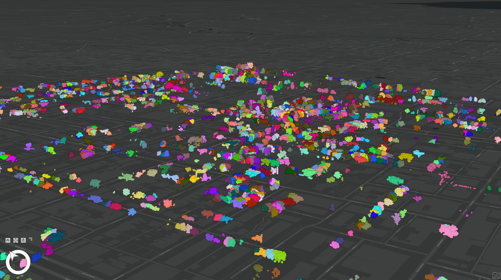

# Urban3D-ML
### Unsupervied Machine Learning pipeline for automatic extraction of Urban Features from 3D LiDAR Point Clouds of Urban Environments.

1. Trees
2. Building Roof and Facada (coming soon)

  

